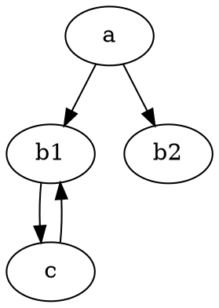
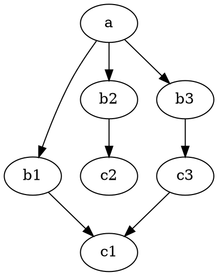

# How and why to freeze a recursive object

In order to cache a function, I need some way to tell if an old result can still be used. I also need some way to use the inputs as keys in an associative array. I would like this associative array to be a hashmap, so that I can look up elements in constant time. However, the function-to-be-cached's inputs may not necessarily be comparable or hashable (in Python, having an `__eq__​` and `__hash__` method).

I need so way to map these arbitray objects into objects that are comparable and hashable. I call that function "freeze" and its ouput the "frozen object." This term comes from Python's standard library where a `set` is mutable (and thus not hashable) but a `frozenset` is immutable (and thus hashable). Mutable objects can't be hashable because they could be inserted into a hashmap when their hash is X and then modified such that their hash is Y.

If two objects have identical observable behavior, then their frozen objects should be identical. The converse, however, has some exceptions. If the frozen objects are equal, the objects have almost identical behavior. For example, two sets might have the same freeze, but their internal iteration order may be different. There are other exceptions that are highly technical, but I don't think they are important, because in all cases I believe "most" user code will not distinguish between these behaviors. It remains to be seen if my assumptions are as widely applicable in real code as I think they are.

Note that the function-to-be-cached is also considered an "input." If the source code of any function in its callgraph changes, the function is not guaranteed to have identical behavior, so it should map to a different frozen object (unless it meets one of the exceptional cases).

In my implementation, frozen objects can be either an immutable primitive value (in Python, this is: `int, float, complex, str, bytes, NoneType, Ellipsis`) or an optionally-ordered immutable container of frozen objects (in Python `frozenset` if unordered or `tuple` if ordered). It follows that all frozen objects are comparable and hashable.

To construct the frozen object, I recursively explore the members of each object. If a member is a primitive value, it maps to itself; if a member is another object, freeze recurses that object (in other words, walking the dynamic ["points-to" graph][1]).

[1]: https://en.wikipedia.org/wiki/Pointer_analysis

E.g.

```python
# This is simplified for the sake of example from the actual behavior of `charmonium.freeze`.

class Struct:
    pass

obj = Struct()
obj.data = 3
obj.member = Struct()
obj.member.data = 4

assert freeze(obj) == (3, (4,))
frozenset({
    ("data", 3),
    ("member", frozenset({
        ("data", 4)
    }))
})
```

Recall that `frozenset({a, b})` is the syntax for a `frozenset` (immutable unordered container) containing `a` and `b` while `(a, b)` is the syntax for `tuple` (immutable ordered container) containing `a` and `b`.

However, this graph can have cycles. Therefore, as I walk the graph, I maintain a set of nodes I have visited before. If a node is in this set, I don't recurse. However, the question is what should I output in that case?

Perhaps, I should just output that a cycle was detected. I will call this `freeze_option0`.

```python
obj = Struct()
obj.data = 3
obj.member = obj
assert freeze_option0(obj) == \
frozenset({
    ("data", 3),
    ("member", "<cycle detected>"),
})
```

As an aside, Python does something similar when printing recursive lists:

```python
a = [0, 1, 2]
a.append(a)
a.append(4)
assert str(a) == "[0, 1, 2, [...], 4]"
# where "[...]" is like my "cycle detected" marker.
```

However, _which_ node we cycle back to could make a difference.

```python
obj0 = Struct()
obj0.data = 1
obj0.member = Struct()
obj0.member.data = 2
obj0.member.member = obj

obj1 = Struct()
obj1.data = 1
obj1.member = Struct()
obj1.member.data = 2
obj1.member.member = obj.member

# Freezes are equal
assert freeze_optoin0(obj0) == freeze_option0(obj1)

# But behavior is distinguishable
assert obj0.member.member.data == 1
assert obj1.member.member.data == 2
```

This has different behavior but the same freeze, which violates the contract of `freeze`. The next question is do I think that real user code will distinguish between the two behaviors. Recursive objects like this might are usually not explicitly constructed, but they can be implicitly constructed by functions, e.g. {`foo() -> bar()`, `bar() -> baz()`, `baz() -> foo()`} vs {`foo() -> bar()`, `bar() -> baz()`, `baz() -> bar()`}, where `f() -> g()` denotes "f calls g".

Another option is to count the objects during search and use the count to identify _which_ node we are recursing to. I will call this `freeze_option1`

```python
assert freeze_option1(obj0) == \
frozenset({
    ("data", 1),
    ("member", frozenset({
        ("data", 2),
        ("member", ("cycle detected", 0)),
        # Cycle back up to the 0th object in this traversal.
    })),
})

assert freeze_option1(obj0) == \
frozenset({
    ("data", 1),
    ("member", frozenset({
        ("data", 2),
        ("member", ("cycle detected", 1)),
        # Cycle back up to the 1st object in this traversal.
    })),
})
```

However, this makes the freeze dependent on where the call to freeze starts. This conflicts with another feature: caching.

```python
obj2 = Struct()
obj2.data = 42
obj2.member = obj0

assert obj0.member.member.data == 1
assert obj2.member.member.member.data == 1

assert freeze_option1(obj2) == \
frozenset({
    ("data", 42),
    ("member", freeze(obj0)),
})

# Suppose freeze_option1(obj0) was already computed and its frozen value is cached.
# Then it should be the same as it was in the last example.

assert freeze_option1(obj2) == \
frozenset({
    ("data", 42),
    ("member", frozenset({
        ("data", 1),
        ("member", frozenset({
            ("data", 2),
            ("member", ("cycle detected", 0)),
            # this is the 0th object in the iteration of freeze_option1(obj0),
            # but not necessarily the 0th object in the iteration of freeze_option1(obj2).
        })),
    })),
})

obj3 = Struct()
obj3.data = 42
obj3.member = Struct()
obj3.member.data = 1
obj3.member.member = Struct()
obj3.member.member.data = 2
obj3.member.member.member = obj3

assert obj3.member.member.member.data == 42

assert freeze_option1(obj3) == \
frozenset({
    ("data", 42),
    ("member", frozenset({
        ("data", 1),
        ("member", frozenset({
            ("data", 2),
            ("member", ("cycle detected", 0)),
            # this is the 0th object in the iteration of freeze_option1(obj2).
        })),
    })),
})
```

Another option could be writing the "relative" level, leaving a marker to the effect of "cycle detected to a node 3 levels above". A frozen value is safe to cache if cycles referring N levels back are at least N levels deep, so that the referent is a descendent (not an ancestor) of the value-to-be-frozen.

However, this strategy still has problems if one level has multiple children. Consider the following points-to graph.



Note that graphviz code can be visualized by pasting it [here][2].

[2]: http://dreampuf.github.io/GraphvizOnline/

Consider a code change that creates an edge `c -> b2` instead of `c -> b1`; The behavior would be different but the freeze would be the same. This is a common operation. Suppose `a` is a module, `b1` and `b2` are module-level functions, and `c` is an inner function. This change might be common.

This can be somewhat ameliorated by including a "sibling number" with the depth, so `b1` is the first child while `b2` is the second child of `a`. When a cycle at `c` is detected, we leave a marker saying "cycle to the first sibling in the level 1 above".

However, this has problems when the referent is a "cousin". Consider



Consider a code change that replaces `c3 -> c1` with `c3 -> c2`. In both cases, the referrent is a cycle to the first child on the same level.

Including a "global" order among nodes in the same generation (e.g. `c1` is the leftmost in the second generation, `c2` is the second leftmost, `c3` is the third) is difficult to implement efficiently, because we don't know _a priori_ what the "root" of the caching is. If we freeze on `a`, then `c1`is in fact the leftmost node in its generation, but if we call freeze on `obj` where `obj -> a`, then `c1` might not be the leftmost node in its generation.

An alternative approach is to rely on something about the object instead of relying on its position in the tree. One could use the object's identity (in Python, this is given by `id(obj);`in CPython, this is implemented as the pointer-address) is not going to be constant between subsequent executions of the same script. One could use the `str(obj)` or `repr(obj)`, but sometimes that includes the memory addresses. For example, `str(lambda: 3)` can evaluate to the string `"<function <lambda> at 0x7f99c4ef3820>"`.

My current (unsatisfying) solution is to use limit caching based on the reference depth, use and to use relative depth sibling-order to identify references. This works but is unsatisfying because completely innocent code can cause `freeze` to break its contract (identical freeze implies identical behavior), which causes the cache to return stale results. I consider this case worse than depending on the order of iteration of a `set`, because in the latter case, the code is not completely innocent; it is either intentionally not reproducible or it contains a logical error.
